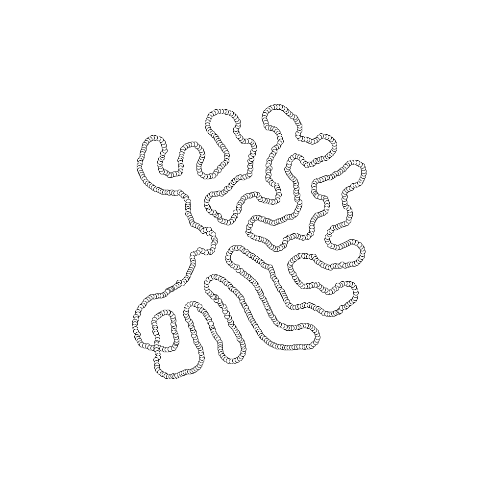

### Hi there 👋

I'm a student at University of Zürich in computer and computational science. My areas of interest are:

🎨 Creative coding with Processing and Processing
🌐 Web development using primarily Svelte
🤖 Data Science and Scientific Data Visualisation in Python   
👨‍💻 Software Development in Java and C++  
🖥️ High Performance computing in C++, CUDA, Fortran  
🎲 Self optimizing systems, generative geometry and textures  

📫 andrinrehmann@gmail.com

[Learn more...](https://andrinrehmann.ch)

